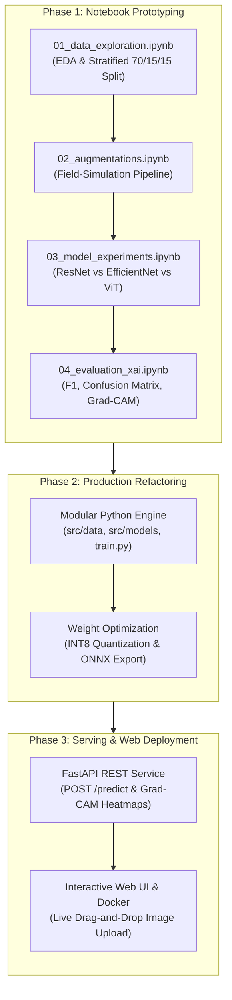

# Crop Identification & Disease Diagnosis System
## End-to-End Build Plan, Multi-Architecture Experimentation Matrix & Deployment Architecture

---

## 1. Executive Summary & Objective

The goal of this project is to develop an industrial-grade, deployable computer vision system that accepts real-world agricultural crop leaf imagery and performs two simultaneous tasks:
1. **Crop Identification**: Identifies the agricultural plant species (e.g., Tomato, Potato, Corn, Apple, Grape, Pepper).
2. **Disease Diagnosis & Health Status**: Detects whether the leaf is healthy or affected by a specific pathology (e.g., Early Blight, Late Blight, Common Rust, Powdery Mildew, Leaf Scorch, Bacterial Spot).

The project is structured with an **experiment-first workflow**: prototyping and hyperparameter sweeps will be conducted first in structured **Jupyter Notebooks**, then systematically refactored into production-ready Python modules, an asynchronous **FastAPI** backend, and an **interactive Web Application** allowing users to upload any plant image for real-time inference and explainable visual heatmaps (Grad-CAM).

---

## 2. Phase-by-Phase Build Workflow (Notebook-First to Production)

```
┌─────────────────────────────────────────────────────────────────────────────┐
│                 Phase 1: Prototyping in Jupyter Notebooks                   │
│   • EDA & Data Hygiene   • Multi-Model Ablations   • Metric Analysis        │
└──────────────────────────────────────┬──────────────────────────────────────┘
                                       │ Refactor
┌──────────────────────────────────────▼──────────────────────────────────────┐
│                  Phase 2: Modular Python Production Code                    │
│   • src/data/            • src/models/             • src/utils/             │
│   • train.py             • evaluate.py             • export_onnx.py         │
└──────────────────────────────────────┬──────────────────────────────────────┘
                                       │ Deploy
┌──────────────────────────────────────▼──────────────────────────────────────┐
│                  Phase 3: Production Serving & Web Deployment               │
│   • FastAPI REST Engine  • Grad-CAM Heatmaps       • Interactive Web UI     │
│   • Docker Container     • Live Cloud Deployment (HuggingFace/Render/AWS)   │
└─────────────────────────────────────────────────────────────────────────────┘
```

### Notebook Organization:
* `notebooks/01_data_exploration_and_hygiene.ipynb`: Dataset distribution, class imbalance detection, image resolution auditing, and data leakage prevention.
* `notebooks/02_data_pipeline_and_augmentations.ipynb`: Visual testing of field-simulation transformations (Albumentations: color jitter, random perspective, blur, Cutout).
* `notebooks/03_model_experiments_and_ablations.ipynb`: Multi-architecture training, fine-tuning sweeps, classification head tuning, and loss function benchmarking.
* `notebooks/04_model_evaluation_and_explainability.ipynb`: Confusion matrix generation, classification reports (Precision/Recall/Macro-F1), and Grad-CAM saliency visualizations.
* `notebooks/05_inference_and_export.ipynb`: Model weight quantization, ONNX export, and local benchmark testing before API integration.

---

## 3. Systematic Experimentation & Ablation Study Matrix

To empirically determine the optimal model architecture, the project conducts a structured ablation across 5 key dimensions:

```
                               EXPERIMENTATION DIMENSIONS
                                           │
  ┌───────────────┬────────────────────────┼────────────────────────┬───────────────┐
  ▼               ▼                        ▼                        ▼               ▼
[Arch Families] [Training Regimes]     [Head Topology]       [Loss Functions]   [Augmentations]
• ResNet-50     • Feature Extraction   • Single Linear       • Cross-Entropy    • Standard Flip
• EfficientNet  • Partial Fine-Tuning  • Linear-BN-ReLU-Drop • Label Smoothing  • Heavy Field
• ViT-B/16      • Full Fine-Tuning     • Layer Dimensions    • Focal Loss         Simulation
```

### 1. Architectural Paradigms Under Comparison
1. **Classic Residual CNN (ResNet-50)**:
   - *Mechanism*: Skip connections ($x + \mathcal{F}(x)$) eliminating vanishing gradients.
   - *Hypothesis*: High baseline stability, well-tested convergence, but higher parameter count (~25.6M) and larger binary size (~98MB).
2. **Modern Compound-Scaled CNN (EfficientNet-B0)**:
   - *Mechanism*: Neural Architecture Search balancing network depth, width, and input resolution with inverted bottleneck (MBConv) blocks.
   - *Hypothesis*: Superior accuracy-per-parameter (~5.3M parameters, ~21MB footprint), fast CPU execution, ideal for mobile/edge deployment.
3. **Vision Transformer (ViT-B/16)**:
   - *Mechanism*: Non-convolutional self-attention mechanism over flattened 16×16 pixel patches.
   - *Hypothesis*: Captures global semantic dependencies across the entire leaf; however, requires larger compute, higher latency (~140ms on CPU), and heavier memory footprint (~340MB).

### 2. Training Regimes (Transfer Learning vs. Fine-Tuning)
* **Experiment A (Frozen Backbone / Feature Extraction)**: Freeze all pre-trained convolutional/attention layers; update only the custom classification head ($lr = 10^{-3}$).
* **Experiment B (Progressive Fine-Tuning - Recommended)**: Warm up the custom head for 3 epochs, then unfreeze the terminal stage (`layer4` in ResNet-50, terminal MBConv blocks in EfficientNet, last 2 Transformer encoder blocks in ViT) with a low learning rate ($lr = 10^{-5}$).
* **Experiment C (Full Network Fine-Tuning)**: Unfreeze all layers with differential learning rates (low for early layers, high for classification head).

### 3. Classification Head Architecture & Regularization
* **Topology 1**: Global Average Pooling $\rightarrow$ Linear($D_{in}$, 38).
* **Topology 2**: Global Average Pooling $\rightarrow$ Linear($D_{in}$, 512) $\rightarrow$ BatchNorm $\rightarrow$ ReLU $\rightarrow$ Dropout($p = 0.4$) $\rightarrow$ Linear(512, 38).
* **Topology 3**: Dropout variation sweep ($p \in \{0.2, 0.4, 0.6\}$) to assess overfitting mitigation.

### 4. Loss Functions & Class Imbalance Handling
* **Standard Cross-Entropy Loss**: Standard multi-class objective.
* **Label Smoothing Cross-Entropy ($\alpha = 0.1$)**: Prevents the model from becoming overconfident on uniform laboratory backgrounds.
* **Focal Loss ($\gamma = 2.0$)**: Down-weights easily classifiable samples and focuses gradients on rare, hard-to-distinguish pathologies.

### 5. Data Augmentation Regimes
* **Regime 1 (Minimal)**: Resize to 224×224, random horizontal flip, ImageNet normalization.
* **Regime 2 (Field-Simulation)**: Random affine rotation ($\pm 30^\circ$), color jitter (brightness, contrast, hue), Gaussian blur, and Cutout/CoarseDropout to simulate occlusions and leaf tears.

---

## 4. Benchmark Metrics & Evaluation Protocol

Every model iteration is evaluated on an isolated **held-out Test Set (15% split)** that is never seen during training or validation.

| Metric Category | Specific Metrics Tracked |
| :--- | :--- |
| **Classification Performance** | Top-1 Accuracy, Top-3 Accuracy, Macro Precision, Macro Recall, Macro F1-Score |
| **Error Diagnostics** | Normalized Confusion Matrix (identifying pairwise disease confusion) |
| **Inference Efficiency** | CPU Latency (ms/image), GPU Latency (ms/image), Throughput (FPS) |
| **Deployment Footprint** | Checkpoint Size (MB), ONNX Quantized Size (MB), RAM Consumption |
| **Explainable AI (XAI)** | **Grad-CAM** saliency overlays (CNNs) & **Attention Rollout** (ViT) |

---

## 5. Web Deployment & Production Architecture

The system is engineered for deployment as an interactive, publicly accessible web application where any user can upload an image from a phone, camera, or file picker.

```
┌─────────────────────────────────────────────────────────────────────────────┐
│                    User Browser / Mobile Client                             │
│       • Drag-and-Drop Image Upload       • Live Camera Capture              │
│       • Real-time Disease Diagnosis      • Grad-CAM Heatmap Visualization   │
└──────────────────────────────────────┬──────────────────────────────────────┘
                                       │ HTTPS Multipart/Form-Data
┌──────────────────────────────────────▼──────────────────────────────────────┐
│                    Inference Service API (FastAPI)                          │
│       • Rate Limiting & Input Validation (Pydantic)                         │
│       • Image Preprocessing Pipeline (Tensor Conversion & Normalization)    │
│       • PyTorch / ONNX Runtime Inference Engine                             │
│       • Grad-CAM Heatmap Generator (Overlay on original image)              │
│       • Treatment & Advisory Knowledge Base JSON Lookup                     │
└──────────────────────────────────────┬──────────────────────────────────────┘
                                       │ JSON Response
┌──────────────────────────────────────▼──────────────────────────────────────┐
│                              API Response Payload                           │
│  {                                                                          │
│    "crop": "Tomato",                                                        │
│    "condition": "Early Blight",                                             │
│    "confidence": 0.974,                                                     │
│    "is_healthy": false,                                                     │
│    "top_3_predictions": [...],                                              │
│    "heatmap_base64": "data:image/jpeg;base64,...",                          │
│    "advisory": "Fungicide application recommended. Prune lower leaves."     │
│  }                                                                          │
└─────────────────────────────────────────────────────────────────────────────┘
```

### Deployment Options:
1. **Interactive Demo Layer**: **Streamlit** for rapid, interactive visualization with sliders for confidence thresholds and side-by-side Grad-CAM rendering.
2. **Production API Layer**: **FastAPI + Uvicorn** containerized with **Docker**, deploying seamlessly to:
   - **HuggingFace Spaces** (Free GPU/CPU hosting, native Streamlit/Gradio support)
   - **Render / AWS EC2 / Google Cloud Run** (Dockerized web service)
3. **Inference Acceleration**: Export final weights to **ONNX Runtime (INT8 quantized)** to achieve sub-15ms CPU inference with zero GPU dependency.

---

## 6. Complete Technology Stack

| Component | Selected Technologies | Rationale |
| :--- | :--- | :--- |
| **Prototyping Environment** | **JupyterLab / VS Code Notebooks** | Step-by-step experimentation, visualization, and rapid iteration |
| **Deep Learning Framework** | **PyTorch 2.x & Torchvision** | Dynamic computational graph, industry standard, flexible fine-tuning |
| **Advanced Vision Models** | `torchvision.models` & `timm` (PyTorch Image Models) | Pre-trained ResNet-50, EfficientNet-B0, ViT-B/16, and Swin Transformer |
| **Augmentation Engine** | **Albumentations** & `torchvision.transforms.v2` | High-speed, reproducible geometric and photometric transforms |
| **Explainable AI (XAI)** | **pytorch-grad-cam** | Visual attribution maps proving the model focuses on biological lesions |
| **Metrics & Validation** | **Scikit-learn, Pandas, NumPy** | Stratified train/val/test split, per-class F1, Confusion Matrix |
| **Serving Backend** | **FastAPI, Uvicorn, Pydantic v2** | High-throughput asynchronous REST API with automatic OpenAPI specs |
| **Frontend UI** | **Streamlit** or **HTML5/Tailwind/JS** | Intuitive file upload, confidence charts, and interactive image inspector |
| **Runtime Optimization** | **ONNX / ONNX Runtime** | Cross-platform hardware acceleration and memory footprint reduction |
| **Packaging & CI/CD** | **Docker & GitHub Actions** | Fully reproducible containerized build deployable to any cloud host |

---

## 7. Step-by-Step Implementation Roadmap



### Detailed Execution Steps:
1. **Step 1 (Notebook 01)**: Load dataset, audit class distributions, remove corrupted images, generate stratified 70/15/15 splits.
2. **Step 2 (Notebook 02)**: Define and inspect augmentations (ColorJitter, Rotation, Cutout) to safeguard against domain shifts.
3. **Step 3 (Notebook 03)**:
   - Train Baseline: **ResNet-50** (Feature Extraction $\rightarrow$ Fine-Tuning).
   - Train Efficient Edge: **EfficientNet-B0** (Compound Scaling).
   - Train Attention Model: **ViT-B/16** (Vision Transformer).
   - Log training curves (Loss, Accuracy, Learning Rate dynamics).
4. **Step 4 (Notebook 04)**: Compare all 3 models on the held-out Test Set. Output comparative metrics table and generate Grad-CAM heatmaps.
5. **Step 5 (Modular Refactor)**: Migrate the best training and inference code from notebooks into clean, testable Python modules (`src/`).
6. **Step 6 (FastAPI Service)**: Expose `/health` and `/predict` endpoints returning classification, confidence, treatment advice, and visual explanation.
7. **Step 7 (Web UI & Cloud Launch)**: Build the frontend upload interface, package into a Docker image, and deploy to live hosting.
