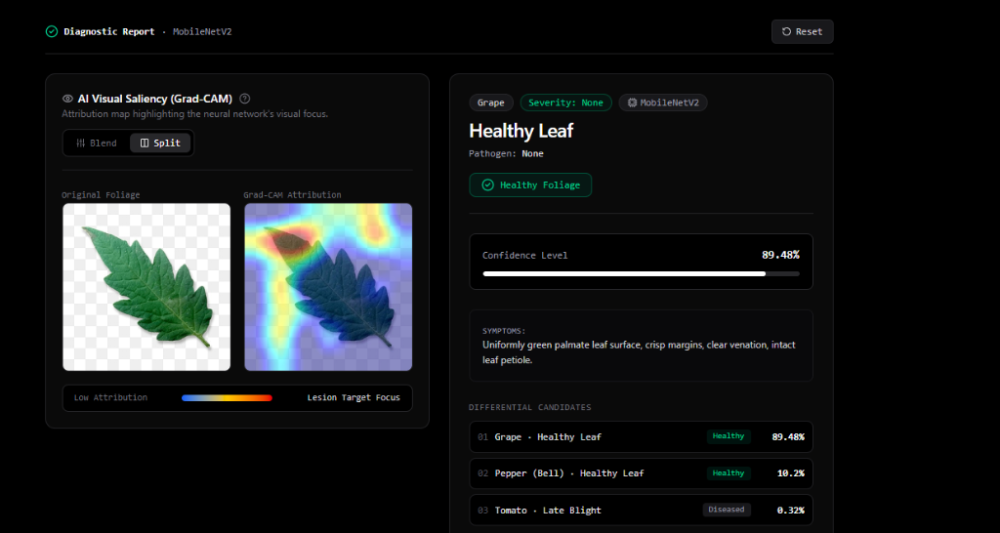

# CropDetect AI 🌿
### Industrial-Grade Automated Crop Identification, Disease Diagnosis & Agronomic Advisory Platform

[](https://www.python.org/)
[](https://fastapi.tiangolo.com/)
[](https://keras.io/)
[](https://nextjs.org/)
[](https://tailwindcss.com/)
[]()
[](https://www.kaggle.com/datasets/vipoooool/new-plant-diseases-dataset)
[](https://opensource.org/licenses/MIT)

---

## 📌 Executive Summary

**CropDetect AI** is an end-to-end precision agriculture intelligence platform designed to empower farmers, agronomists, and researchers with instantaneous, accurate crop identification and plant disease diagnosis. Leveraging state-of-the-art computer vision and deep convolutional neural networks, the system identifies **38 distinct crop pathologies and healthy conditions across 14 vital crop species** with **98.51% validation accuracy**.

Beyond standard classification, CropDetect AI bridges the gap between deep learning and real-world farm management by providing:
1. **Explainable AI (Grad-CAM)** visual attention heatmaps that highlight the exact foliar lesions guiding the neural network's diagnosis.
2. **In-Field Image Quality Auditing** (Laplacian variance blur estimation and illumination diagnostics) to eliminate false classifications caused by out-of-focus or poorly lit phone snapshots.
3. **Dual Deep Learning Architecture** supporting both high-throughput, edge-optimized **MobileNetV2** and maximum-accuracy **EfficientNet-B0**, with simultaneous side-by-side comparative inference.
4. **Actionable Agronomic Knowledge Base** offering comprehensive pathology profiles, pathogen classifications, organic remedies, targeted chemical treatments, and cultural sanitation protocols for every diagnosis.

---

## 🌟 Key Capabilities & Features

### 🧠 Dual AI Architecture (Edge vs. High-Precision)
- **MobileNetV2 (Default Edge Model)**: Employs inverted residual blocks and depthwise separable convolutions (~23.8 MB footprint), delivering sub-50ms inference latency on standard CPUs—ideal for live in-field smartphone diagnosis.
- **EfficientNet-B0 (High-Precision Model)**: Employs compound scaling balancing network depth, width, and resolution (~19.0 MB footprint), achieving **98.51% validation accuracy**.
- **Side-by-Side Model Comparison**: The web client allows simultaneous diagnostic benchmarking between MobileNetV2 and EfficientNet-B0 on the same leaf sample.

### 🔍 Explainable AI (Grad-CAM Heatmaps)
- Generates Gradient-weighted Class Activation Mapping (**Grad-CAM**) overlays by computing the gradients of the top predicted class score with respect to the final convolutional feature maps.
- Produces normalized, 2D attention heatmaps colorized with OpenCV's `COLORMAP_JET` and alpha-blended over the high-resolution input leaf.
- Interactive web viewer includes a real-time **opacity slider (0%–100%)**, view mode toggles (Overlay vs. Heatmap vs. Original), and side-by-side comparative inspectors.

### 📷 In-Field Image Quality & Blur Diagnostics
- Automated quality control powered by OpenCV:
  - **Blur Detection**: Measures the Laplacian variance ($\sigma^2_{\text{Laplacian}}$). Values below $80.0$ trigger an instant "blurry / out-of-focus" warning.
  - **Illumination Analysis**: Audits mean grayscale pixel luminance ($<35.0$ indicates underexposure; $>240.0$ indicates extreme glare/overexposure).
  - Provides actionable on-screen guidance (e.g., *"Hold camera steady"*, *"Move to brighter lighting"*).

### 📱 Field-Ready Camera & Ingestion Modes
- **Live Smartphone & Webcam Camera**: Direct access to `navigator.mediaDevices.getUserMedia` with mobile rear-facing camera support (`facingMode: "environment"`), visual viewfinder alignment guides, and animated shutter flash.
- **Drag-and-Drop Image Uploader**: Accepts JPEG, PNG, and WEBP formats with instant local client-side image preview.
- **Built-in Sample Gallery**: 6 pre-loaded reference leaf samples (e.g., Tomato Early Blight, Corn Common Rust, Apple Scab, Healthy Bell Pepper) for immediate zero-upload testing and live demonstrations.

### 📚 Comprehensive Agronomic Advisory Database
- Every diagnosis queries `data/disease_info.json` to present structured, farmer-first recommendations:
  - **Severity Rating**: None, Low, Moderate, High, Severe.
  - **Pathogen Classification**: Fungal, Bacterial, Viral, Parasitic (Mite), or None (Healthy).
  - **Identified Symptoms**: Precise visual descriptions of lesion morphology, foliar halos, and chlorosis.
  - 🌿 **Organic & Biological Controls**: Neem oil, *Trichoderma*, *Bacillus subtilis*, compost tea, botanical bio-fungicides.
  - 🧪 **Chemical / Conventional Controls**: Targeted active ingredients (copper hydroxide, chlorothalonil, azoxystrobin, mancozeb) with spray intervals and resistance management.
  - 🛡️ **Cultural Prevention & Farm Hygiene**: Drip irrigation protocols, canopy aeration pruning, certified resistant seed varieties, crop rotation schedules.

---

## 🏗️ System Architecture & Workflow

```
┌─────────────────────────────────────────────────────────────────────────────┐
│                          User Interface (Next.js 16)                        │
│   • Live Camera (Rear facingMode)       • Drag-and-Drop File Upload         │
│   • Built-in Sample Gallery             • Dual-Model Architecture Selector  │
│   • Grad-CAM Opacity Blender            • Agronomic Advisory Card           │
└──────────────────────────────────────┬──────────────────────────────────────┘
                                       │ HTTPS Multipart/Form-Data
                                       ▼
┌─────────────────────────────────────────────────────────────────────────────┐
│                       FastAPI Asynchronous Backend Engine                   │
│   • Pydantic v2 Request Validation      • CORS Multi-Origin Middleware      │
│   • OpenAPI / Swagger Documentation     • Dynamic Model Cache Singleton     │
└───────────────────┬─────────────────────────────────────┬───────────────────┘
                    │                                     │
    ┌───────────────▼───────────────┐     ┌───────────────▼───────────────┐
    │     Image Preprocessing       │     │     Deep Learning Inference   │
    │  • Resize to 224x224 RGB      │     │  • MobileNetV2 (Edge)         │
    │  • Laplacian Blur Check       │     │  • EfficientNet-B0 (98.51%)   │
    │  • Exposure / Luminance Audit │     │  • Top-K Softmax Probabilities│
    └───────────────┬───────────────┘     └───────────────┬───────────────┘
                    │                                     │
                    └──────────────────┬──────────────────┘
                                       ▼
┌─────────────────────────────────────────────────────────────────────────────┐
│                         Explainability & Knowledge Base                     │
│   • Grad-CAM Saliency Backpropagation (Target Conv Layer Gradients)         │
│   • JET Colormap Blending on Original High-Res Leaf Image                   │
│   • Curated 38-Class Agronomic Advisory Lookup (data/disease_info.json)     │
└──────────────────────────────────────┬──────────────────────────────────────┘
                                       │ JSON Response Payload
                                       ▼
┌─────────────────────────────────────────────────────────────────────────────┐
│  {                                                                          │
│    "model_used": "MobileNetV2",                                             │
│    "crop": "Tomato", "condition": "Early Blight", "confidence": 98.42,      │
│    "status": "Diseased", "severity": "Moderate", "pathogen_type": "Fungal", │
│    "image_quality": { "rating": "Excellent", "blur_score": 142.5 },         │
│    "top_candidates": [...],                                                 │
│    "organic_controls": ["Neem oil spray...", "Bacillus subtilis..."],       │
│    "chemical_controls": ["Chlorothalonil...", "Copper fungicide..."],       │
│    "prevention": ["Avoid overhead irrigation...", "Crop rotation..."],      │
│    "heatmap_base64": "data:image/jpeg;base64,...",                          │
│    "overlay_base64": "data:image/jpeg;base64,..."                           │
│  }                                                                          │
└─────────────────────────────────────────────────────────────────────────────┘
```

---

## 🖥️ Live Application & Explainable AI (XAI) Previews

### 1. MobileNetV2 — Split Attribution Mode (Edge Architecture)

<div align="center">
  
</div>

#### 📋 Diagnostic Report & Result Breakdown (MobileNetV2):
- **Model Architecture**: **MobileNetV2** (Optimized for edge execution and sub-50ms CPU latency)
- **Diagnosed Condition**: **Tomato — Septoria Leaf Spot** (*Septoria lycopersici*)
- **Health Status & Severity**: 🔴 **Pathology Detected** | **Moderate Severity**
- **Primary Model Confidence**: **87.94%**
- **AI Visual Saliency (Grad-CAM)**: **Split Mode** — Displays the original foliage photograph side-by-side with the raw Grad-CAM attribution map, highlighting lesion target focus points across the leaf surface.
- **Symptoms Observed**: Numerous small circular spots (1/8 inch) with dark margins and gray/tan centers dotted with tiny black pycnidia specs.
- **Differential Candidates**:
  1. `01` **Tomato • Septoria Leaf Spot** (Diseased) — **87.94%**
  2. `02` **Tomato • Target Spot** (Diseased) — **7.63%**
  3. `03` **Grape • Healthy Leaf** (Healthy) — **4.12%**
- **Agronomic Action Plan & Remedies (Organic)**:
  - Remove lower affected leaves promptly.
  - Spray copper fungicides starting when first cluster flowers emerge.

---

### 2. MobileNetV2 — Healthy Foliage Diagnosis (Grape)

<div align="center">
  
</div>

#### 📋 Diagnostic Report & Result Breakdown (MobileNetV2 - Healthy Baseline):
- **Model Architecture**: **MobileNetV2** (Edge Architecture)
- **Diagnosed Condition**: **Grape — Healthy Leaf**
- **Health Status & Severity**: 🟢 **Healthy Foliage** | **Severity: None** (Pathogen: None)
- **Primary Model Confidence**: **89.48%**
- **AI Visual Saliency (Grad-CAM)**: **Split Mode** — Demonstrates clean baseline leaf attribution without concentrated necrotic hotspot triggers.
- **Symptoms / Visual Markers**: Uniformly green palmate leaf surface, crisp margins, clear venation, intact leaf petiole.
- **Differential Candidates**:
  1. `01` **Grape • Healthy Leaf** (Healthy) — **89.48%**
  2. `02` **Pepper (Bell) • Healthy Leaf** (Healthy) — **10.2%**
  3. `03` **Tomato • Late Blight** (Diseased) — **0.32%**

---

### 3. EfficientNet-B0 — Interactive Blend Mode (Compound Scaling Architecture)

<div align="center">
  
</div>

#### 📋 Diagnostic Report & Result Breakdown (EfficientNet-B0):
- **Model Architecture**: **EfficientNet-B0** (Compound scaling balancing depth, width, and resolution; 98.51% validation accuracy)
- **Diagnosed Condition**: **Tomato — Septoria Leaf Spot** (*Septoria lycopersici*)
- **Health Status & Severity**: 🔴 **Pathology Detected** | **Moderate Severity**
- **Primary Model Confidence**: **77.72%**
- **AI Visual Saliency (Grad-CAM)**: **Interactive Blend Mode** — Features a real-time opacity slider set at **55% AI Attention**, directly projecting the JET colormap attention heatmap onto physical leaf necrosis and petiole junctions.
- **Symptoms Observed**: Numerous small circular spots (1/8 inch) with dark margins and gray/tan centers dotted with tiny black pycnidia specs.
- **Differential Candidates**:
  1. `01` **Tomato • Septoria Leaf Spot** (Diseased) — **77.72%**
  2. `02` **Tomato • Target Spot** (Diseased) — **16.25%**
  3. `03` **Grape • Black Rot** (Diseased) — **6.02%**
- **Agronomic Action Plan & Remedies (Organic)**:
  - Remove lower affected leaves promptly.
  - Spray copper fungicides starting when first cluster flowers emerge.

---

## 📂 Repository File Structure

```
cropdetect/
├── app/                               # FastAPI Application Layer
│   ├── __init__.py
│   ├── api.py                         # REST API endpoints (/health, /classes, /predict, /disease)
│   └── schemas.py                     # Pydantic v2 validation models and response schemas
├── data/
│   └── disease_info.json              # Complete 38-class agronomic advisory & treatment database
├── frontend/                          # Next.js 16 Web Application
│   ├── src/
│   │   ├── app/
│   │   │   ├── layout.tsx             # Root layout with Tailwind CSS styling
│   │   │   └── page.tsx               # Primary dashboard (Camera, Upload, Diagnosis, Comparison)
│   │   ├── components/
│   │   │   ├── CameraCapture.tsx      # Live webcam/mobile environment camera capture
│   │   │   ├── DiagnosisCard.tsx      # Pathology profile, symptoms, remedies, prevention
│   │   │   ├── GradCamViewer.tsx      # Interactive Grad-CAM opacity slider & side-by-side inspector
│   │   │   ├── Header.tsx             # Application navigation & server connection status
│   │   │   ├── ImageUploader.tsx      # Drag-and-drop file ingestion with preview
│   │   │   └── SampleGallery.tsx      # Quick-test library of diverse crop leaf samples
│   │   ├── lib/
│   │   │   └── api.ts                 # Typed HTTP client communicating with FastAPI backend
│   │   └── types/
│   │       └── index.ts               # TypeScript data contracts matching API schemas
│   ├── package.json                   # Frontend dependencies (React 19, Tailwind v4, Lucide)
│   └── tsconfig.json
├── models/                            # Production AI Models & Metadata
│   ├── class_names.json               # Canonical list of 38 plant pathology classes
│   ├── crop_model.keras               # Trained EfficientNet-B0 model weights (98.51% val accuracy)
│   ├── mobilenet.keras                # Trained MobileNetV2 edge model weights
│   ├── config.json                    # Keras 3 model topology configuration
│   ├── metadata.json                  # Keras training timestamp & framework version
│   └── model.weights.h5               # HDF5 model weights checkpoint
├── src/                               # Core AI & Image Processing Engine
│   ├── __init__.py
│   ├── config.py                      # System hyperparameters, paths, and thresholds
│   ├── gradcam.py                     # Grad-CAM attention gradient extraction and overlay blending
│   ├── model_loader.py                # Cached model loading singleton (EfficientNet & MobileNet)
│   ├── predictor.py                   # High-level pipeline tying preprocessing, inference & XAI
│   └── preprocessing.py               # Decoding, normalization, Laplacian blur & exposure checks
├── tests/                             # Automated Test Suite (pytest)
│   ├── test_api.py                    # Endpoint validation tests
│   └── test_full_suite.py             # End-to-end suite: artifacts, advisory, quality, Grad-CAM, API
├── .gitignore                         # Git exclusion rules
├── PROJECT_BUILD_PLAN.md              # Research, ablation studies, and architectural roadmap
├── README.md                          # Master project documentation
├── requirements.txt                   # Production Python dependencies
└── run.py                             # Master multi-service orchestration CLI launcher
```

---

## 🗃️ Training & Benchmark Dataset

Both the **MobileNetV2** and **EfficientNet-B0** deep learning models in CropDetect AI are trained, validated, and benchmarked on the widely recognized **[New Plant Diseases Dataset (Augmented)](https://www.kaggle.com/datasets/vipoooool/new-plant-diseases-dataset)** hosted on Kaggle:

- **Dataset Source**: [Kaggle — New Plant Diseases Dataset by Vipul Sachdeva](https://www.kaggle.com/datasets/vipoooool/new-plant-diseases-dataset)
- **Dataset Scale**: **87,000+ RGB leaf photographs** (pre-split into `train`, `valid`, and `test` directories).
- **Taxonomic Scope**: **14 Agricultural Crop Species** across **38 Discrete Pathological & Healthy Classes** (26 diseased conditions + 12 healthy controls).
- **Data Preprocessing & Augmentations**:
  - Re-created and augmented from the foundational **PlantVillage** dataset.
  - Features an 80/20 training-to-validation partition.
  - Applies offline and online field-simulation augmentations (random geometric rotations, perspective tilts, horizontal/vertical flips, and color/illumination jittering) to prevent background bias and promote robust in-field generalization under natural sunlight.

---

## 📊 Supported Crops & Pathologies (38 Classes)

The system classifies across **14 agricultural crop species** spanning **38 pathological and healthy conditions**:

| Crop | Pathological Conditions & Healthy Baselines | Primary Pathogen Type |
| :--- | :--- | :--- |
| **Apple** | Apple Scab (*Venturia inaequalis*), Black Rot (*Botryosphaeria obtusa*), Cedar Apple Rust (*Gymnosporangium juniperi-virginianae*), Healthy | Fungal / None |
| **Blueberry** | Healthy | None |
| **Cherry** | Powdery Mildew (*Podosphaera clandestina*), Healthy | Fungal / None |
| **Corn (Maize)** | Cercospora Gray Leaf Spot (*Cercospora zeae-maydis*), Common Rust (*Puccinia sorghi*), Northern Leaf Blight (*Exserohilum turcicum*), Healthy | Fungal / None |
| **Grape** | Black Rot (*Guignardia bidwellii*), Esca / Black Measles (*Phaeomoniella chlamydospora*), Leaf Blight / Isariopsis, Healthy | Fungal / None |
| **Orange** | Citrus Greening / Huanglongbing (*Candidatus Liberibacter*) | Bacterial (Phloem-limited) |
| **Peach** | Bacterial Spot (*Xanthomonas arboricola pv. pruni*), Healthy | Bacterial / None |
| **Pepper (Bell)** | Bacterial Spot (*Xanthomonas campestris pv. vesicatoria*), Healthy | Bacterial / None |
| **Potato** | Early Blight (*Alternaria solani*), Late Blight (*Phytophthora infestans*), Healthy | Fungal / Oomycete / None |
| **Raspberry** | Healthy | None |
| **Soybean** | Healthy | None |
| **Squash** | Powdery Mildew (*Erysiphe cichoracearum*) | Fungal |
| **Strawberry** | Leaf Scorch (*Diplocarpon earlianum*), Healthy | Fungal / None |
| **Tomato** | Bacterial Spot, Early Blight (*Alternaria solani*), Late Blight (*Phytophthora infestans*), Leaf Mold (*Fulvia fulva*), Septoria Leaf Spot (*Septoria lycopersici*), Two-Spotted Spider Mite (*Tetranychus urticae*), Target Spot (*Corynespora cassiicola*), Yellow Leaf Curl Virus (TYLCV), Mosaic Virus (ToMV), Healthy | Bacterial, Fungal, Oomycete, Parasitic Mite, Viral, None |

---

## ⚙️ Technical Specifications & Thresholds

| Parameter | Value / Metric | Description |
| :--- | :--- | :--- |
| **Input Image Dimensions** | `224 × 224 × 3` | Scaled via bilinear interpolation preserving high-resolution buffer for Grad-CAM overlay |
| **Normalization Range** | `[0.0, 1.0]` or `[-1.0, 1.0]` | Handled dynamically based on backbone architecture |
| **Laplacian Blur Threshold** | `80.0` | Grayscale variance of Laplacian filter; scores below this flag image as blurry |
| **Minimum Brightness** | `35.0` | Mean 8-bit grayscale intensity; lower values indicate severe underexposure |
| **Maximum Brightness** | `240.0` | Mean 8-bit grayscale intensity; higher values indicate severe overexposure / washout |
| **Confidence Threshold** | `60.0%` | Baseline alert threshold for primary diagnostic certainty |
| **Grad-CAM Alpha Blend** | `0.45` | Default overlay transparency between heat visualizer and RGB photo |
| **Validation Accuracy** | `98.51%` | Evaluated across held-out multi-class plant pathology validation set |

---

## 🚀 Quick Start Guide

### 1. System Requirements
- **Python**: Version 3.10, 3.11, 3.12, or 3.13
- **Node.js**: Version 20.0 or higher
- **pnpm**: Recommended package manager (`npm install -g pnpm`)

---

### 2. Installation

#### Clone the Repository
```bash
git clone https://github.com/Pranav1632/crop_detection.git
cd crop_detection
```

#### Set Up Python Environment
Create and activate a virtual environment:
```bash
# Windows (PowerShell)
python -m venv .venv
.venv\Scripts\Activate.ps1

# Linux / macOS
python3 -m venv .venv
source .venv/bin/activate
```

Install Python dependencies:
```bash
pip install -r requirements.txt
```

*(Optional development & testing packages)*:
```bash
pip install pytest httpx
```

#### Set Up Frontend Dependencies
```bash
cd frontend
pnpm install
cd ..
```

---

### 3. Running the Application

CropDetect AI includes a unified orchestration script (`run.py`):

#### Option A: Launch Full-Stack System (Backend + Frontend)
```bash
python run.py dev
```
This automatically initiates both the FastAPI backend on port `8000` and the Next.js frontend on port `3000`.

#### Option B: Launch Services Individually
- **FastAPI Backend only**:
  ```bash
  python run.py api
  # Or directly via Uvicorn:
  uvicorn app.api:app --host 0.0.0.0 --port 8000 --reload
  ```
- **Next.js Web Client only**:
  ```bash
  python run.py ui
  # Or directly via pnpm:
  cd frontend && pnpm dev
  ```

---

### 4. Accessing the Application

Once launched, open your web browser to access:
- 🌐 **Web User Interface**: [http://localhost:3000](http://localhost:3000)
- 📜 **Interactive API Documentation (Swagger UI)**: [http://localhost:8000/docs](http://localhost:8000/docs)
- 📖 **Alternative API Documentation (ReDoc)**: [http://localhost:8000/redoc](http://localhost:8000/redoc)
- 🩺 **Backend Health & Model Status**: [http://localhost:8000/health](http://localhost:8000/health)

---

## 📡 REST API Reference

The FastAPI service exposes a complete set of REST endpoints for integration into mobile applications, drone pipelines, or IoT smart farm gateways.

### 1. Health & Status
```http
GET /health
```
**Response (`200 OK`)**:
```json
{
  "status": "healthy",
  "model_loaded": true,
  "classes_count": 38,
  "framework": "TensorFlow 2.x / Keras 3 (EfficientNet-B0)",
  "version": "1.0.0",
  "supported_models": ["EfficientNet-B0", "MobileNetV2"]
}
```

---

### 2. List All Crop Pathologies
```http
GET /classes
```
Returns all 38 classes categorized hierarchically by crop species.

**Response (`200 OK`)**:
```json
{
  "total_classes": 38,
  "total_crops": 14,
  "crops": {
    "Tomato": [
      {
        "class_name": "Tomato___Early_blight",
        "condition": "Early Blight",
        "status": "Diseased",
        "severity": "Moderate"
      },
      {
        "class_name": "Tomato___healthy",
        "condition": "Healthy",
        "status": "Healthy",
        "severity": "None"
      }
    ]
  }
}
```

---

### 3. Agronomic Disease Profile
```http
GET /disease/{class_name}
```
Retrieves the deep agronomic profile and treatment protocols for a specific class identifier.

**Example Request**:
```bash
curl -X GET "http://localhost:8000/disease/Tomato___Early_blight"
```

**Response (`200 OK`)**:
```json
{
  "class_name": "Tomato___Early_blight",
  "crop": "Tomato",
  "condition": "Early Blight",
  "status": "Diseased",
  "severity": "Moderate",
  "pathogen_type": "Fungal (Alternaria solani)",
  "symptoms": "Dark brown circular spots with concentric rings forming a target-like pattern, primarily on older lower leaves.",
  "organic_controls": [
    "Apply copper-based organic fungicides or liquid copper octanoate at first appearance.",
    "Spray bio-fungicide containing Bacillus subtilis to prevent lesion colonization.",
    "Remove infected lower foliage and burn or dispose of away from compost."
  ],
  "chemical_controls": [
    "Apply chlorothalonil or mancozeb at 7-10 day intervals during warm, humid conditions.",
    "Rotate with azoxystrobin (QoI) or difenoconazole (DMI) to prevent resistance development."
  ],
  "prevention": [
    "Utilize drip irrigation to avoid leaf wetness; avoid overhead sprinklers.",
    "Stake and prune plants to maximize air circulation through the canopy.",
    "Practice a 3-4 year crop rotation away from all Solanaceous family crops."
  ]
}
```

---

### 4. Disease Inference & Grad-CAM Analysis
```http
POST /predict
```
Accepts an image upload and executes the end-to-end diagnostics and visual explainability pipeline.

**Form Parameters**:
- `file` *(UploadFile, required)*: The image file (JPEG, PNG, WEBP).
- `top_k` *(int, default: 3)*: Number of top candidate classifications to return.
- `include_gradcam` *(bool, default: true)*: Whether to compute and return Grad-CAM heatmaps.
- `model_type` *(string, default: "mobilenet")*: Model architecture (`"mobilenet"` or `"efficientnet"`).

**Example cURL Command**:
```bash
curl -X POST "http://localhost:8000/predict" \
  -F "file=@tests/sample_leaf.jpg" \
  -F "top_k=3" \
  -F "include_gradcam=true" \
  -F "model_type=mobilenet"
```

**Response (`200 OK`)**:
```json
{
  "model_used": "MobileNetV2",
  "crop": "Tomato",
  "condition": "Early Blight",
  "class_name": "Tomato___Early_blight",
  "status": "Diseased",
  "is_healthy": false,
  "confidence": 98.42,
  "severity": "Moderate",
  "pathogen_type": "Fungal (Alternaria solani)",
  "symptoms": "Dark brown circular spots with concentric rings forming a target-like pattern...",
  "organic_controls": ["Apply copper-based fungicides...", "Spray Bacillus subtilis..."],
  "chemical_controls": ["Apply chlorothalonil...", "Rotate with azoxystrobin..."],
  "prevention": ["Utilize drip irrigation...", "Stake and prune..."],
  "top_candidates": [
    {
      "class_name": "Tomato___Early_blight",
      "crop": "Tomato",
      "condition": "Early Blight",
      "status": "Diseased",
      "confidence": 98.42
    },
    {
      "class_name": "Tomato___Target_Spot",
      "crop": "Tomato",
      "condition": "Target Spot",
      "status": "Diseased",
      "confidence": 1.25
    },
    {
      "class_name": "Tomato___healthy",
      "crop": "Tomato",
      "condition": "Healthy",
      "status": "Healthy",
      "confidence": 0.18
    }
  ],
  "image_quality": {
    "blur_score": 145.2,
    "brightness_score": 128.4,
    "is_blurry": false,
    "is_too_dark": false,
    "is_overexposed": false,
    "rating": "Excellent",
    "issues": [],
    "is_acceptable": true
  },
  "original_image_base64": "data:image/jpeg;base64,...",
  "heatmap_base64": "data:image/jpeg;base64,...",
  "overlay_base64": "data:image/jpeg;base64,..."
}
```

---

## 🧪 Automated Testing Suite

The repository includes a comprehensive regression and unit test suite verifying backend components, model inference, XAI algorithms, and data integrity.

Run the test suite:
```bash
pytest tests/test_full_suite.py -v
```

### Verified Test Cases:
1. `test_artifacts_exist`: Validates existence of model weights (`crop_model.keras`, `mobilenet.keras`), class mappings (`class_names.json`), and agronomic database (`disease_info.json`).
2. `test_knowledge_base_integrity`: Verifies all 38 classes contain non-empty disease profiles, status flags, symptoms, organic remedies, and prevention advice.
3. `test_image_quality_check`: Audits Laplacian variance blur detection and illumination boundaries on synthetic test tensors.
4. `test_predictor_and_gradcam`: Executes forward inference and backpropagation Grad-CAM extraction across both MobileNetV2 and EfficientNet-B0 architectures.
5. `test_fastapi_endpoints`: End-to-end integration tests using FastAPI's `TestClient` for `/health`, `/classes`, and `/predict`.

---

## 🌐 Environment Variables & Configuration

System settings can be configured via environment variables or directly in `src/config.py`:

| Variable | Default Value | Description |
| :--- | :--- | :--- |
| `API_HOST` | `0.0.0.0` | Host binding for the FastAPI backend server |
| `API_PORT` | `8000` | Port for the FastAPI backend server |
| `NEXT_PUBLIC_API_URL` | `http://localhost:8000` | URL consumed by the Next.js client to reach FastAPI |

---

## 🚢 Deployment Strategies

### 1. Docker Containerization (Backend)
Create a `Dockerfile` for the serving engine:
```dockerfile
FROM python:3.11-slim
WORKDIR /app
COPY requirements.txt .
RUN pip install --no-cache-dir -r requirements.txt
COPY . .
EXPOSE 8000
CMD ["uvicorn", "app.api:app", "--host", "0.0.0.0", "--port", "8000"]
```
Build and run:
```bash
docker build -t cropdetect-api .
docker run -p 8000:8000 cropdetect-api
```

### 2. Vercel Deployment (Frontend)
The Next.js client is ready for zero-configuration deployment on [Vercel](https://vercel.com):
1. Import the `frontend/` directory into Vercel.
2. Configure the environment variable:
   ```env
   NEXT_PUBLIC_API_URL=https://your-cropdetect-backend.onrender.com
   ```
3. Deploy!

---

## 📜 Citation & Academic Use

If you utilize CropDetect AI or its agronomic database in research or agricultural extension projects, please cite:

```bibtex
@software{cropdetect_ai_2026,
  author = {CropDetect AI Team},
  title = {CropDetect AI: Automated Crop Identification, Disease Diagnosis & Agronomic Advisory Platform},
  year = {2026},
  url = {https://github.com/Pranav1632/crop_detection}
}

@dataset{new_plant_diseases_dataset,
  author = {Vipul Sachdeva},
  title = {New Plant Diseases Dataset (Augmented)},
  year = {2019},
  publisher = {Kaggle},
  url = {https://www.kaggle.com/datasets/vipoooool/new-plant-diseases-dataset}
}
```

---

## 📄 License

This project is licensed under the **MIT License**. You are free to use, modify, distribute, and commercialize this software for precision farming, academic research, and agronomic advisory services.
