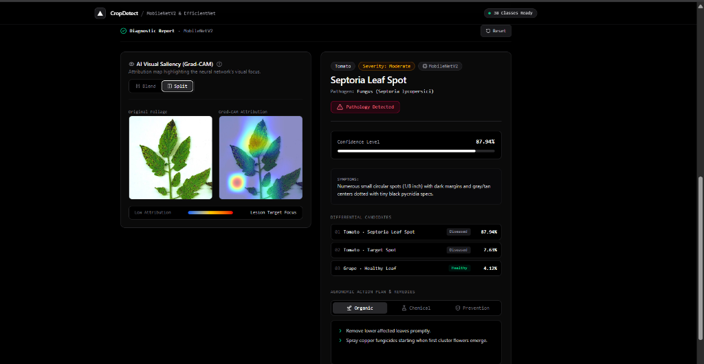
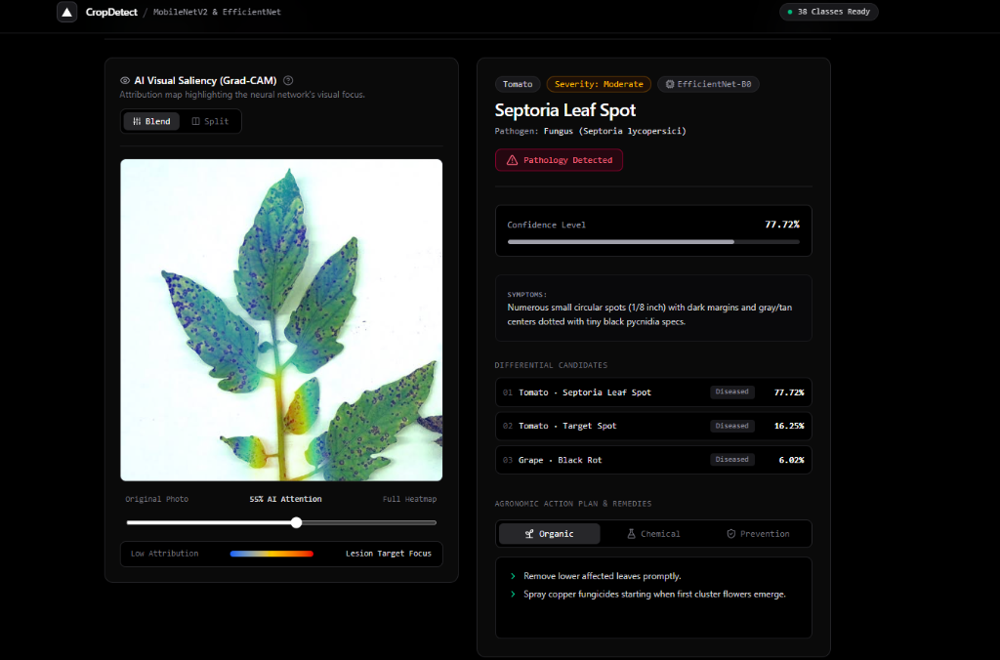

# CropDetect AI — Next.js 16 Web Application 🌾

This directory contains the production-grade frontend client for **CropDetect AI**, built with **Next.js 16 (App Router)**, **React 19**, **Tailwind CSS v4**, and **Lucide Icons**.

---

### 1. MobileNetV2 (Split Saliency Mode)
<div align="center">
  
</div>

- **Diagnosed Disease**: Tomato — Septoria Leaf Spot (87.94% confidence)
- **Status**: 🔴 Pathology Detected (Moderate Severity)
- **Visual Saliency**: Split Mode displaying foliage alongside raw Grad-CAM lesion focus
- **Top Candidates**: Septoria (87.94%), Target Spot (7.63%), Grape Healthy (4.12%)

---

### 2. EfficientNet-B0 (Interactive Blend Mode)
<div align="center">
  
</div>

- **Diagnosed Disease**: Tomato — Septoria Leaf Spot (77.72% confidence)
- **Status**: 🔴 Pathology Detected (Moderate Severity)
- **Visual Saliency**: 55% AI Attention opacity slider overlaid directly onto leaf lesions
- **Top Candidates**: Septoria (77.72%), Target Spot (16.25%), Grape Black Rot (6.02%)

---

## 🌟 Key Features

- **Live Camera Ingestion**: Direct browser camera access using `navigator.mediaDevices.getUserMedia` with mobile rear-facing camera support (`facingMode: "environment"`), visual alignment frame guide, and shutter flash animation.
- **Drag-and-Drop Image Uploader**: Fast client-side image loading and instant image preview before diagnosis.
- **Built-in Sample Gallery**: 6 diverse pre-loaded leaf samples for instant 1-click diagnostic testing without uploading files.
- **Dual Model Selection & Comparative Mode**:
  - Switch dynamically between **MobileNetV2** (Edge-optimized, sub-50ms CPU latency) and **EfficientNet-B0** (98.51% validation accuracy).
  - Side-by-side comparison mode to evaluate both model outputs simultaneously on the same leaf.
- **Interactive Explainable AI (Grad-CAM)**:
  - Interactive opacity slider (0%–100%) to blend visual heatmaps with high-resolution leaf photographs.
  - Multi-view inspector (Overlay, Raw Heatmap, Original Leaf).
- **In-Field Image Quality Warnings**: Visual alerts when Laplacian blur or lighting diagnostics flag poor photography conditions.
- **Agronomic Action Plans**: Clean collapsible cards detailing symptoms, severity, organic bio-controls, chemical treatments, and preventative hygiene.

---

## 📂 Component Directory

```
frontend/src/
├── app/
│   ├── layout.tsx             # Root layout with metadata and styling
│   └── page.tsx               # Main dashboard with camera, uploader, model switch, and diagnostics
├── components/
│   ├── CameraCapture.tsx      # Live webcam/phone camera with rear-facing toggle
│   ├── DiagnosisCard.tsx      # Agronomic advisory, symptoms, remedies, prevention tabs
│   ├── GradCamViewer.tsx      # Interactive Grad-CAM opacity slider and view inspector
│   ├── Header.tsx             # App header with backend connectivity indicator
│   ├── ImageUploader.tsx      # File dropzone with thumbnail preview
│   └── SampleGallery.tsx      # Built-in reference leaf samples for 1-click testing
├── lib/
│   └── api.ts                 # Typed HTTP client calling FastAPI backend (/predict, /health)
└── types/
    └── index.ts               # TypeScript data definitions matching backend Pydantic schemas
```

---

## 🚀 Getting Started

### 1. Prerequisites
- Node.js 20+
- pnpm (`npm install -g pnpm`)

### 2. Install Dependencies
```bash
pnpm install
```

### 3. Configure Environment
Create a `.env.local` file (optional, defaults to `http://localhost:8000`):
```env
NEXT_PUBLIC_API_URL=http://localhost:8000
```

### 4. Run Development Server
```bash
pnpm dev
```
Open [http://localhost:3000](http://localhost:3000) in your browser.

### 5. Production Build
```bash
pnpm build
pnpm start
```
